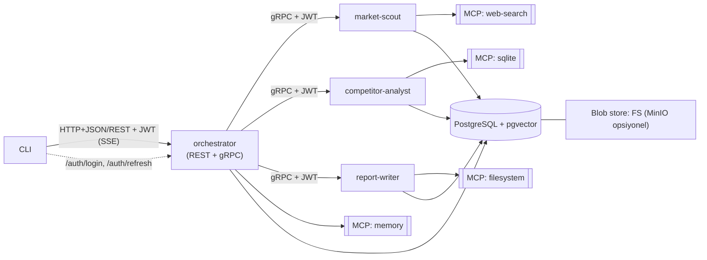

# a2a-research-crew

A2A (Agent-to-Agent) protokolünü uçtan uca öğrenmek için geliştirilen, Go ile
yazılmış çok ajanlı bir **otomatik pazar ve rakip araştırması** sistemi.

Bir kullanıcı CLI üzerinden bir şirket/ürün ve hedef verir. Organizatör ajan
isteği alt görevlere böler, üç uzman ajana gRPC üzerinden devreder ve sonuçta
bir araştırma raporu **artefaktı** üretir. Tüm süreç A2A protokolünün temel
bileşenlerini (AgentCard, Task, Message, Part, Context, Artifact, Streaming)
kullanır.

> Durum: **Phase 0 (iskelet ve altyapı)**. Ajanlar henüz iş mantığı içermez.

## Mimari



## Ajanlar

| Ajan | Rol | Taşıma | MCP |
|---|---|---|---|
| `orchestrator` | Planlama, delegasyon, sentez | REST (dış) + gRPC | memory |
| `market-scout` | Pazar verisi toplama → `market-brief` | gRPC | web-search |
| `competitor-analyst` | Rakip analizi → `competitor-matrix` | gRPC | sqlite / kod |
| `report-writer` | Nihai rapor → `final-report` | gRPC | filesystem |

Her ajan; LLM entegrasyonu, system instruction, memory, skill tanımı, MCP
kullanımı ve tool-calling yeteneklerine sahiptir.

## Teknoloji kararları

- **Dil:** Go (`go1.26`).
- **A2A framework:** `github.com/a2aproject/a2a-go/v2` (v2.6.0).
- **MCP:** resmi `github.com/modelcontextprotocol/go-sdk`.
- **Binding:** dış istek → HTTP+JSON/REST; ajanlar arası → gRPC.
- **Kimlik doğrulama:** JWT (HS256, access + refresh).
- **Veritabanı:** PostgreSQL + pgvector (görev bağlamı, hafıza, metadata);
  artefakt blob'ları için dosya sistemi (MinIO opsiyonel).
- **UI yok:** yalnızca backend + CLI.

## Kurulum ve çalıştırma

Docker ile tüm yığını ayağa kaldırma (stage/preview provası):

```bash
cp .env.example .env
make up
```

Go toolchain ile host üzerinde doğrulama:

```bash
make fmt vet test build
```

Ayrıntılı mimari ve akışlar için [`docs/`](./docs) dizinine bakın.

## Yol haritası

- [x] **Phase 0** — İskelet, bağımlılıklar, tooling, Docker artefaktları
- [x] **Phase 1** — Ortak çekirdek (config, LLM, MCP, JWT, taskstore, memory)
- [x] **Phase 2** — İlk uzman ajan (`market-scout`) uçtan uca
- [x] **Phase 3** — Diğer uzmanlar (`competitor-analyst`, `report-writer`)
- [x] **Phase 4** — Organizatör (REST girişi + gRPC + streaming)
- [x] **Phase 5** — CLI
- [ ] **Phase 6** — Kalıcılık ve sağlamlaştırma
- [ ] **Phase 7** — Dokümantasyon ve finalizasyon
