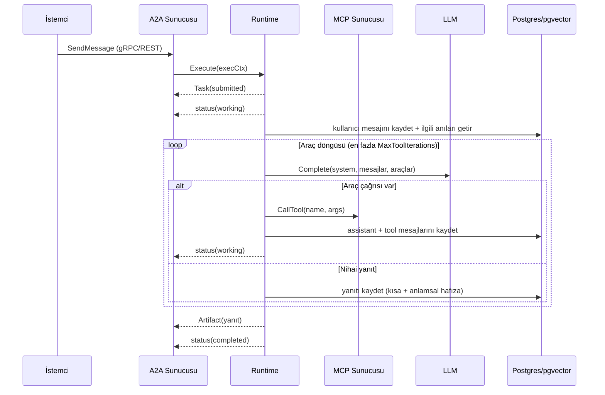

# Ajanlar

Bu doküman ajan yürütme modelini ve uzman ajanları açıklar.

## Ortak yürütme döngüsü (`internal/agentruntime`)

Her ajan aynı `Runtime` üzerinden çalışır ve `a2asrv.AgentExecutor` sözleşmesini
uygular. Bir istek geldiğinde:

- **System instruction** her ajana özgüdür.
- **Memory**: kısa vadeli (bağlam içi mesajlar) ve uzun vadeli (anlamsal,
  pgvector) birlikte kullanılır; geçmiş oturumlardan ilgili kayıtlar sistem
  talimatına eklenir.
- **MCP / tool-calling**: araç tanımları MCP sunucularından keşfedilir; model
  araç çağırdıkça döngü devam eder.
- **Artifact**: nihai yanıt bir A2A artefaktı olarak yayınlanır.

## Sunucu iskeleti (`internal/agentapp`)

`agentapp.Run`, bir ajan süreci için tüm kablolamayı yapar:

1. Yapılandırma + logger.
2. LLM sağlayıcısı (mock/gerçek) ve embedder.
3. PostgreSQL görev deposu (`taskstore`) ve hafıza (`memory`) + şema migration.
4. Agent'a özel MCP araçları (`ToolsetFactory`).
5. JWT doğrulama interceptor'ı (secret varsa).
6. `a2agrpc` A2A sunucusu + genel AgentCard HTTP sunucusu.
7. Sinyalle zarif kapanış.

## market-scout (Phase 2)

- **Skill**: `market_research`.
- **Araç**: `web_search` (MCP). `MCP_WEBSEARCH_URL` boşsa deterministik
  in-process sahte sunucu kullanılır.
- **Artefakt**: `market-brief`.
- **Taşıma**: yalnızca gRPC (ajanlar arası iletişim).
- **Model**: `MARKET_SCOUT_MODEL` (boşsa sağlayıcı varsayılanı).

## competitor-analyst (Phase 3)

- **Skill**: `competitor_analysis`.
- **Araç**: izole **sqlite** MCP çalışma alanı — `run_sql`, `list_tables`.
- **İzolasyon**: SQL, uygulamanın operasyonel PostgreSQL verisine erişemez;
  ajan yalnızca kendi sqlite dosyasında çalışır (`MCP_SQLITE_DIR`).
- **Artefakt**: `competitor-matrix`.
- **Model**: `COMPETITOR_ANALYST_MODEL`.

## report-writer (Phase 3)

- **Skill**: `report_writing`.
- **Araç**: kısıtlanmış (jail) **dosya sistemi** MCP çalışma alanı —
  `write_file`, `read_file`, `list_dir`.
- **İzolasyon**: tüm yollar `MCP_FS_ROOT` altına hapsedilir; `../` ile kaçış
  köke normalize edilir.
- **Artefakt**: `final-report`.
- **Model**: `REPORT_WRITER_MODEL`.

## MCP araç sunucuları

| Sunucu | Paket | Araçlar | Amaç |
|---|---|---|---|
| web-search | `internal/websearch` | `web_search` | Pazar verisi toplama (gerçek HTTP veya in-process) |
| sqlite | `internal/sqlitemcp` | `run_sql`, `list_tables` | İzole SQL analizi |
| filesystem | `internal/workspacefs` | `write_file`, `read_file`, `list_dir` | Kısıtlanmış dosya yazımı |

Tümü MCP protokolü üzerinden konuşur. sqlite ve filesystem sunucuları süreç
içinde (`mcpx.NewInProcessServer`) çalışır; web-search harici bir URL verilirse
gerçek bir HTTP MCP sunucusuna bağlanır.

