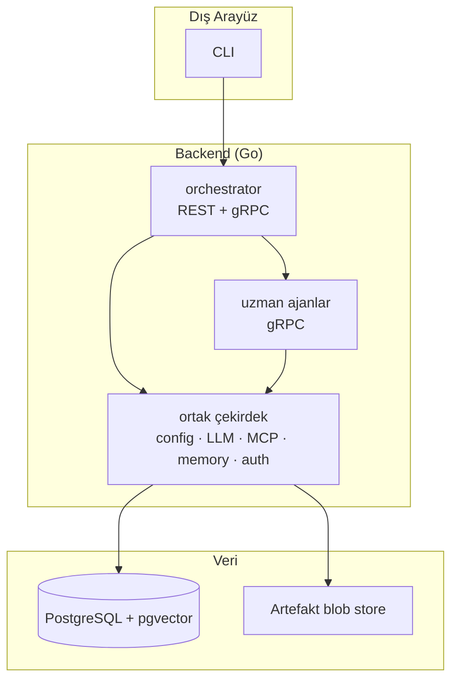

# Mimari

Bu doküman `a2a-research-crew` sisteminin mimarisini, katmanlarını ve A2A
protokolü ile ilişkisini anlatır. Phase 7'de kapsamlı şekilde genişletilecektir.

## Katmanlar

## A2A kavram eşlemesi

| A2A bileşeni | Bu projede karşılığı |
|---|---|
| AgentCard | Her ajanın skill/capabilities/yetki bildirimi |
| Task | Her ajan çağrısının kalıcı görev kaydı (`taskstore`) |
| Message / Part | CLI ↔ orchestrator ve orchestrator ↔ uzman mesajları |
| Context | Bir araştırma oturumu (birden çok görev) |
| Artifact | Ara çıktılar + nihai rapor |
| Streaming | Uzun süren üretimde kademeli çıktı (SSE) |

## İlkeler

- Ajanlar ayrı süreçler/portlar olarak çalışır; aralarındaki iletişim gerçek
  ağ üzerinden gRPC'dir.
- Ortak çekirdek tekrarı önler; her ajan aynı `LLMProvider`, `memory`, MCP ve
  auth altyapısını kullanır.
- Testler ağ ve gerçek API anahtarı gerektirmez: `mock` sağlayıcı ve sahte MCP
  sunucuları ile çalışır.
