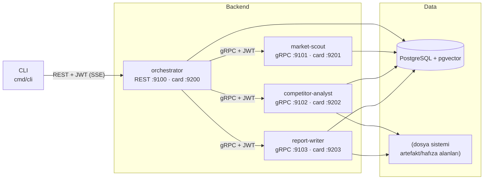
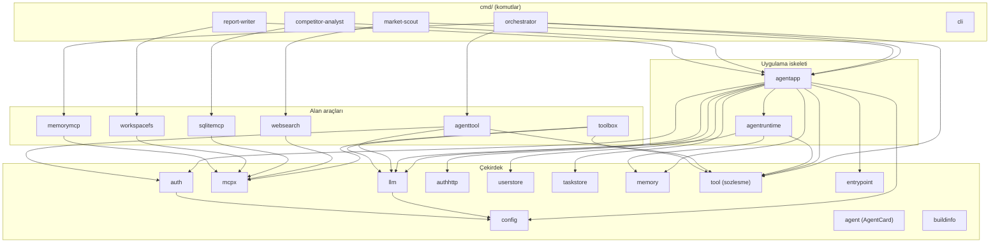
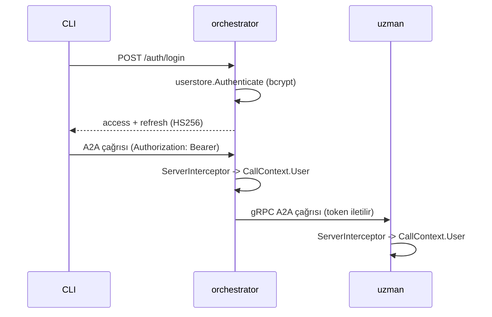

# Mimari

Bu doküman `a2a-research-crew` sisteminin mimarisini, katmanlarını, veri
depolarını ve A2A protokolü ile ilişkisini anlatır.

## Genel bakış

Sistem, her biri bağımsız bir süreç/port olarak çalışan dört A2A ajanından ve
bunları tüketen bir CLI'dan oluşur. Dış dünyaya yalnızca **orchestrator** açılır
(HTTP+JSON/REST); ajanlar arası tüm iletişim **gRPC** üzerinden yürür. Tüm
sınırlar **JWT** ile korunur.

## Paket katmanları

Bağımlılıklar tek yönlüdür; döngü yoktur.

## Veri depoları ve erişim desenleri

| Veri | Depo | Erişim deseni | Neden |
|---|---|---|---|
| Görev/bağlam durumu | `a2a_tasks` (PostgreSQL, JSONB) | OCC (`version`), kullanıcı izolasyonu, sayfalama | ACID + evrilebilir şema |
| Kısa vadeli hafıza | `memory_messages` | Sıralı ekleme, son N okuma | Bağlam içi konuşma |
| Uzun vadeli hafıza | `memory_semantic` (pgvector) | Cosine benzerlik, namespace | Anlamsal geri çağırma |
| Kullanıcılar | `users` | bcrypt doğrulama | Güvenli kimlik |
| SQL analizi | izole sqlite dosyası | Ajanın kendi MCP araçları | Operasyonel DB'den yalıtım |
| Rapor çalışma alanı | `MCP_FS_ROOT` (jail) | `write_file`/`read_file` | Kısıtlanmış yazma |
| Artefakt blob'ları | `BLOB_FS_ROOT` (MinIO opsiyonel) | metadata DB'de | Büyük içeriği DB dışında tut |

## Taşımalar ve binding kuralları

- **Dış istek:** `a2asrv.NewRESTHandler` ile HTTP+JSON/REST; AgentCard'da
  `TransportProtocolHTTPJSON` arayüzü yayınlanır.
- **Ajanlar arası:** `a2agrpc` ile gRPC; AgentCard'da `TransportProtocolGRPC`.
- Bir istemci (`a2aclient`), karttaki `SupportedInterfaces` ile taşımayı
  otomatik seçer. Orchestrator uzmanları gRPC, CLI orchestrator'ı REST ile
  konuşur.

## Kimlik doğrulama mimarisi

- **Üretim/doğrulama:** `internal/auth` (HS256, access + refresh).
- **Sunucu:** `auth.ServerInterceptor` token'ı doğrular, `CallContext.User`'ı
  doldurur; taskstore kullanıcı izolasyonu bundan beslenir.
- **İstemci:** `auth.ClientInterceptor` giden çağrıya Bearer ekler; orchestrator
  gelen token'ı uzmanlara iletir (yoksa servis token'ı üretir).
- **Uçlar:** `internal/authhttp` (`/auth/login`, `/auth/refresh`), kullanıcılar
  `internal/userstore` (bcrypt).

## Hafıza mimarisi

- **Kısa vadeli:** bağlam (`ContextID`) bazlı mesaj geçmişi; her LLM çağrısında
  pencere olarak yüklenir.
- **Uzun vadeli:** cevaplar `agent:<ad>:user:<kullanıcı>` namespace'i ile
  gömülür; tur başında sorguya en yakın kayıtlar sistem talimatına eklenir.
- **Embedder:** sağlayıcıya göre gerçek (OpenAI uyumlu) ya da mock; vektör
  boyutu tek sabittir (`memory.DefaultEmbeddingDimensions`).

## Tasarım ilkeleri

- **Mock-first:** her dış bağımlılığın anahtarsız bir ikizi vardır
  (`llm.NewMock`, `mcpx.NewInProcessServer`, `memory.NewMockStore`).
- **Tek çekirdek, çok ajan:** ajan eklemek yalnızca bir `Spec` + kart + araç
  seti yazmaktır.
- **Güvenlik sınırları kodda:** SQL izole sqlite'ta, dosya sistemi jail'de.
- **Gözlemlenebilirlik:** yapısal `slog`; her ajan `working` olaylarında araç
  çağrılarını bildirir.
