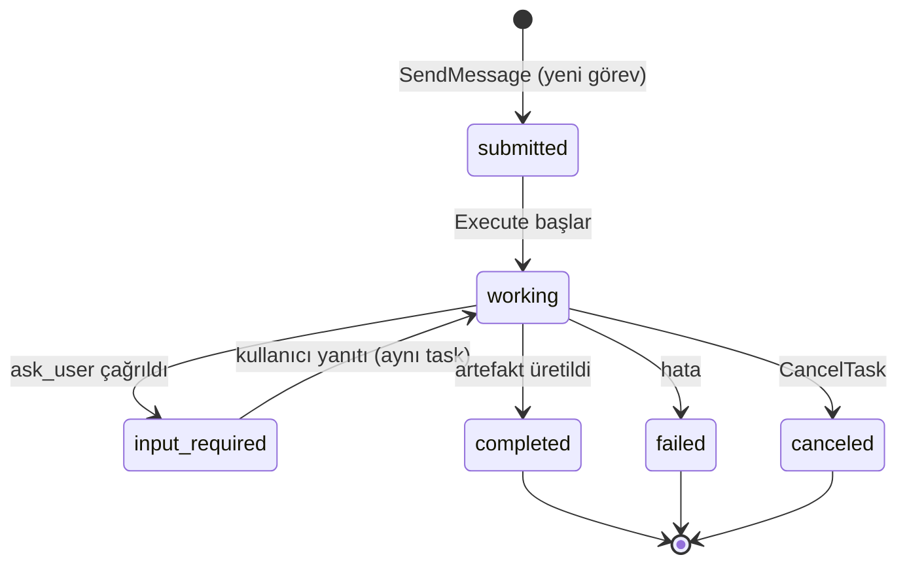
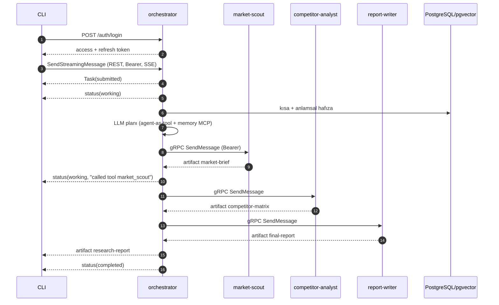
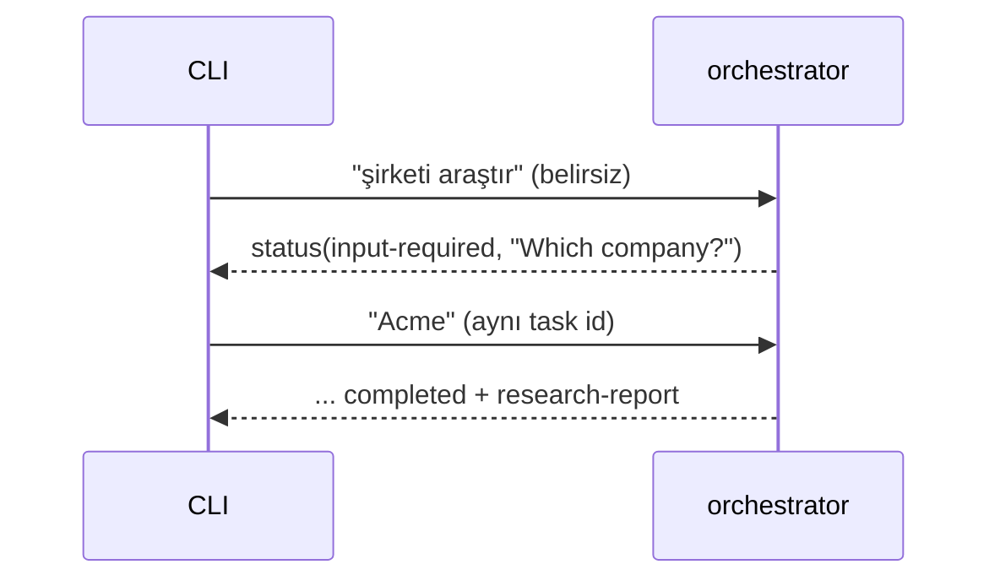

# A2A Protokol Akışları

Bu doküman, sistemin A2A protokolünün hangi bileşenlerini nasıl kullandığını ve
uçtan uca akışları gösterir.

## A2A kavram eşlemesi

| A2A bileşeni | Bu projede karşılığı | Kod |
|---|---|---|
| AgentCard | Her ajanın kimliği, skill'i, taşımaları, güvenlik şeması | `internal/agent` |
| Task | Her ajan çağrısının kalıcı görev kaydı | `internal/taskstore` |
| Message / Part | CLI↔orchestrator ve orchestrator↔uzman mesajları | `a2a.NewMessage`, `NewTextPart` |
| Context | Bir araştırma oturumu (birden çok görev) | `Task.ContextID` |
| Artifact | Ara çıktılar + nihai rapor | `a2a.NewArtifactEvent` |
| Streaming | `SendStreamingMessage` (SSE) | `capabilities.streaming` |
| TaskState | Görev yaşam döngüsü | aşağıdaki durum diyagramı |
| `input-required` | `ask_user` aracı ile insan-döngüde | `agentruntime.Spec.ClarificationTool` |
| Push notification | **Kapsam dışı (ertelendi)** | — |

## Görev yaşam döngüsü

- Terminal durumlar (`completed`, `failed`, `canceled`, `rejected`) görevi
  değişmez kılar; tamamlanmış bir görevi iptal denemesi protokol hatası verir.
- Executor, terminal/input-required olayından sonra akışı durdurur; çıplak bir
  `a2a.Message` olayı da akışı bitirir (bu yüzden ilerleme bildirimi
  `TaskStatusUpdateEvent` ile yapılır).

## Uçtan uca akış

## Streaming olayları

`send` komutu şu olayları canlı yazar:

| Olay | Anlamı |
|---|---|
| `*a2a.Task` | Görev oluşturuldu (submitted) |
| `*a2a.TaskStatusUpdateEvent` | Durum değişimi; `working` mesajları araç çağrılarını gösterir |
| `*a2a.TaskArtifactUpdateEvent` | Artefakt güncellemesi (metin toplanır) |
| `*a2a.Message` | Serbest mesaj (akışı bitirir) |

## `input-required` akışı

Orchestrator'ın system talimatı, istek somut bir şirket/ürün içermiyorsa önce
`ask_user` çağırmasını söyler. Bu, A2A'nın insan-döngüde özelliğini gösterir.

## Kimlik sınırları

- **Dış sınır (CLI→orchestrator):** REST + JWT; yetkisiz istek
  `missing bearer token` ile reddedilir.
- **İç sınır (orchestrator→uzmanlar):** gRPC + JWT; token iletilir (yoksa
  servis token'ı üretilir).
- Her iki sınır da aynı `CallContext.User` çözümlemesine bağlanır; taskstore
  kullanıcı izolasyonu bunun üzerine kurulur.
