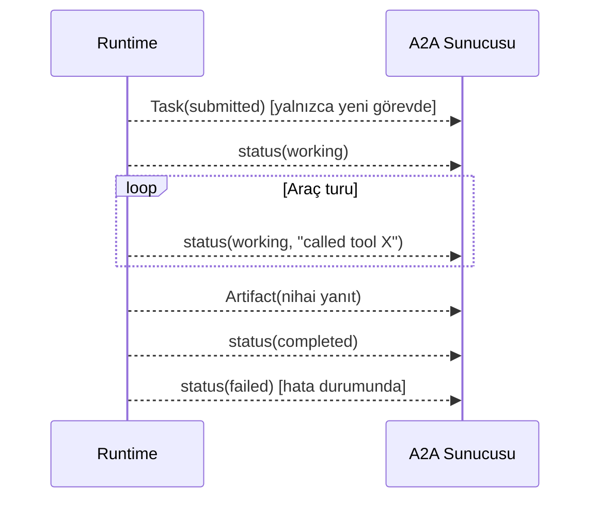

# Phase 2 — Muhakeme Günlüğü

Bu doküman, **Phase 2 (ilk uzman ajan `market-scout` uçtan uca)** görevinde
yaptığım inceleme, alternatif değerlendirme, karar ve doğrulama adımlarının
gerekçelerini içerir. Amaç yalnızca "ne yapıldı"yı değil, **neden öyle
yapıldığını** kayıt altına almak.

---

## 0. Görevin kapsamı ve genel yaklaşım

Faz hedefi netti: ilk uzman ajanı (market-scout) **uçtan uca** kurmak; yani
AgentCard, gRPC A2A sunucusu, LLM system instruction, MCP aracı, memory ve
tool-calling birlikte çalışacak.

Benim yaklaşımım şu sırayla oldu:

1. **Önce SDK sözleşmelerini doğrula, sonra kod yaz.** Ajan yazacaksak
   `a2asrv.ExecutorContext` gerçek alanlarını, olay (event) kurallarını ve
   taşıma detaylarını bilmeden tasarım yapmak varsayım olurdu.
2. **Tek bir ajanı özel yazma; ortak bir çalışma zamanı çıkar.** Phase 3'te iki
   uzman daha gelecek. market-scout'a özel tek seferlik kod yazmak, kısa vadede
   hızlı ama Phase 3'te kopyala-yapıştır borcu yaratırdı.
3. **Mock/dry-run ile ilerle.** API anahtarı olmadan tüm akışın test edilebilir
   olması, önceki fazdaki kuralımızdı; bunu bozmadım.
4. **Doğrulamayı kanıta dayandır.** "Derleniyor" yeterli değil; gerçek gRPC
   round-trip + canlı süreç + JWT'li çağrı ile uçtan uca gösterdim.

---

## 1. Kontrolü alırken ilk inceleme

### 1.1 Neden önce `ExecutorContext`'i okudum?

Bir `AgentExecutor` yazacaksam, elimde hangi bağlam olduğunu bilmem gerekir:
task/context kimlikleri, gelen mesaj, kullanıcı, servis parametreleri.
SDK'nın `exectx.go` dosyasını okuduğumda şunları gördüm:

- `Message` (isteği tetikleyen mesaj)
- `TaskID`, `ContextID`
- `StoredTask` (devam eden görev ise dolu)
- **`User *User`** — bu önemliydi, çünkü memory ad alanını kullanıcıya göre
  ayırmak istiyordum ve ekstra bir yerde kullanıcı aramama gerek kalmadı.

Bu alanları bilmeden yazsaydım, "kullanıcıyı interceptor'dan context'e koyup
oradan çekeceğim" gibi gereksiz bir dolambaç kurardım.

### 1.2 Olay (event) kurallarını neden kritik buldum?

`agentexec.go` dokümantasyonunda şu uyarı vardı: A2A sunucusu, **herhangi bir
payload taşıyan bir `a2a.Message` olayından sonra** olay işlemeyi durdurur;
ayrıca terminal durum ve `input-required` da akışı bitirir.

Bu, tasarımı doğrudan etkiledi:

- İlerleme bildirimi için **çıplak `a2a.Message` olayı yayınlamamalıyım**,
  aksi hâlde akış erken biter.
- Bunun yerine `a2a.NewStatusUpdateEvent(execCtx, TaskStateWorking, msg)`
  kullanmalıyım; bu bir `TaskStatusUpdateEvent`'tir ve akışı durdurmaz,
  yalnızca "working" durumunu mesajla zenginleştirir.

Bu kuralı bilmeseydim, "araç çağrısı ilerlemesini mesaj olarak yayınlayayım"
derdim ve akış sessizce bozulurdu.

---

## 2. Mimari kararlar

### 2.1 Ortak yürütme döngüsü: `internal/agentruntime`

**Karar:** Tüm ajanların paylaşacağı tek bir `Runtime`, `a2asrv.AgentExecutor`
sözleşmesini uygular.

**Değerlendirdiğim alternatifler:**

- *(A)* Her ajanın `Execute`'unu kendi paketinde yazmak.
- *(B)* Ortak bir runtime + ajana özel `Spec` (system instruction, model,
  araçlar, artefakt adı).

**(B)**'yi seçtim çünkü:

- Hafıza yükleme, LLM çağrısı, araç döngüsü, olay üretimi **tamamen aynı**;
  fark yalnızca içerik (talimat/model/skill/araç).
- Ajan eklemek Phase 3'te "bir Spec + bir ToolsetFactory yaz" kadar ucuz olur.
- Hata yönetimi ve olay akışı tek yerde tutarlı kalır.

**Döngü tasarımı:**

```
kullanıcı mesajını hafızaya yaz
→ anlamsal hafızadan ilgili kayıtları getir, system instruction'a ekle
→ son N mesajı yükle
→ döngü:
    LLM.Complete(system, mesajlar, araçlar)
    araç çağrısı yoksa → nihai yanıt: hafızaya yaz + Remember → dön
    araç çağrısı varsa → tool mesajlarını çalıştır, hafızaya yaz, working bildir
→ MaxToolIterations aşılırsa hata
```

**Neden `MaxToolIterations`?** Sonsuz araç döngüsü (model bir türlü sonuca
varamazsa) sistemin kilitleyebileceği gerçek bir riskti. Bir üst sınır koydum ve
bu sınırı bir testle doğruladım.

### 2.2 Araç soyutlaması: ayrı `internal/tool` paketi (bir hata sonrası düzeltme)

**İlk (yanlış) denemem:** `agentruntime` içinde hem `ToolResult` tipini hem
`ToolProvider` arayüzünü tanımladım; `toolbox` ise kendi `Result` tipini
döndürüyordu.

**Derleme hatası:** `*toolbox.Toolbox does not implement ToolProvider (wrong
type for method CallTool)` — çünkü dönüş tipleri farklıydı
(`toolbox.Result` vs `agentruntime.ToolResult`).

**Alternatifler:**

- *(A)* `toolbox`, `agentruntime`'ı import etsin → `toolbox`'u runtime'a bağlar,
  katman tersine döner.
- *(B)* `agentruntime`, `toolbox`'u import etsin → runtime'ı beton bir
  implementasyona bağlar; test stub'ları zorlaşır.
- *(C)* Nötr bir `internal/tool` paketinde `Result` + `Provider` tanımla; ikisi
  de onu kullansın.

**(C)**'yi seçtim. Bu, "arayüzü tüketen taraf değil, ortak dil sahibi taraf
tanımlar" ilkesine uyar; `agentruntime` yalnızca `tool.Provider`'a bağlıdır ve
test stub'ı (`stubTools`) kolayca yazılabilir.

### 2.3 `internal/toolbox`: çoklu MCP sunucusu birleştirme

**Karar:** Birden çok MCP istemcisindeki araçları tek listede topla; çağrıyı
sahibine yönlendir.

**Düşündüğüm risk:** Araç adı çakışması. İki MCP sunucusu da `search` adında
araç sunarsa, hangisinin çağrılacağı belirsizleşir ve sessizce yanlış araç
çalışabilir.

**Tercih ettiğim davranış:** Önekleme (ör. `server__tool`) yerine **çakışmayı
hata olarak reddetmek**. Gerekçe: önekleme, modele sunulan araç adlarını
kullanıcıya sezgisel olmayan biçimde değiştirir ve modelin araç seçimini
zorlaştırır. Öğrenme projesinde tek web-search sunucusu var; çakışma olursa
bunu erken ve açıkça görmek daha değerli. Bunu bir testle sabitledim
(`TestToolboxRejectsDuplicateToolNames`).

### 2.4 `internal/websearch`: gerçek/fake ikiliği

**Karar:** `web_search` aracı sunan bir MCP istemcisi üret.

**İkilem:** Gerçek bir web-arama MCP sunucusuna bağlanmak için (a) bir URL ve
(b) genelde bir API anahtarı gerekir; ikisi de şu an yok.

**Çözüm:**

- `MCP_WEBSEARCH_URL` doluysa → gerçek streamable HTTP MCP sunucusuna bağlan,
  anahtarı `Authorization: Bearer` olarak ilet.
- Boşsa → **in-process sahte MCP sunucusu**.

**Neden sahte sunucu düz bir fonksiyon değil de gerçek bir MCP sunucusu?**
Çünkü asıl öğrenmek istediğimiz şey MCP protokol akışı (araç keşfi → çağrı →
sonuç). Sahte sunucu, SDK'nın in-memory transport'u üzerinden **gerçek MCP
konuşması** yapar; böylece tool-calling yolu, gerçek entegrasyondan farksız
biçimde test edilmiş olur. Düz bir stub bunu test etmezdi.

### 2.5 `internal/agentapp`: ortak sunucu iskeleti

**Karar:** Bir ajan sürecini ayağa kaldıran tüm kablolamayı tek yerde topla.

**Neden?** Aksi hâlde her `cmd/*/main.go` şunları tekrar yazardı: Postgres
havuzu + migration, embedder seçimi, LLM sağlayıcı seçimi, auth interceptor,
gRPC sunucusu, AgentCard HTTP sunucusu, sinyal yakalama, zarif kapanış.
Bunları `cmd`'lere dağıtmak, ajan sayısı arttıkça bakımı zorlaştırır.

**Ayrım:** Değişen kısım `Options` (Spec, kart bilgileri, portlar, `BuildTools`)
olarak dışarı çıkarıldı; değişmeyen kısım (kablolama) `agentapp` içinde kaldı.

**Embedder seçimi:** Sağlayıcı gerçek ve anahtar varsa OpenAI uyumlu embedder;
aksi hâlde mock embedder. Böylece anahtar yokken memory hattı yine çalışır.

**Auth:** `JWT_SECRET` yoksa interceptor kurulmaz ve bir **uyarı loglanır**
(sessizce yutma yok). Varsa `required=true` ile zorunlu kılınır.

### 2.6 `entrypoint`: sunucu bayrakları ve logger

**Karar:** `Parse`'ı bozmadan `ParseServer` eklemek ve logger kurulumunu
`NewLogger(level)` olarak ayırmak.

**Neden ayrı fonksiyon?** `cli` ile ajan sunucularının ihtiyacı farklı: CLI'da
gRPC/card portu anlamsız. `Parse`'ı zorla ortaklaştırmak yerine sunucuya özel
bir fonksiyon ekledim; mevcut çağrı yerlerini bozmadım.

### 2.7 Embedding boyutu: tek sabit

**Karar:** pgvector kolon boyutunu **tek bir sabitte** (`memory.DefaultEmbeddingDimensions = 1536`)
toplamak.

**Gerekçe:** Ajan `1536`, entegrasyon testleri `64` kullanıyordu. Aynı
veritabanı üzerinde farklı boyutla tablo oluşturulunca "expected 64 dimensions,
not 1536" hatası doğdu (bkz. §5). Sağlayıcı değişse bile şemanın tutarlı
kalması için boyutu tek yere sabitledim. Gerçek gömme modeli (text-embedding-3-small)
de 1536 boyutludur, yani gerçekçi bir seçim.

---

## 3. A2A olay akışı kararları

Yayınladığım olay dizisi:



- **`submitted` yalnızca `StoredTask == nil` iken**: devam eden bir görevin
  geçmişini sıfırlamamak için. Bu, SDK dokümantasyonundaki kalıba uygun.
- **`working` başlangıçta**: istemciye "iş başladı" sinyali ve streaming
  tüketicilerine ilk olay.
- **Artefakt adı** (`market-brief`): A2A `Artifact.Name` alanını doldurdum ki
  orkestratör/CLI hangi artefaktın ne olduğunu anlayabilsin.
- **Hata → `failed` durum olayı, `error` döndürmek yerine**: SDK dokümantasyonu
  "ilk olaydan sonra hata döndürmeyin, failed durum olayı yayın" diyor. Böylece
  görev geçmişi ve durumu kalıcı olur.

**Streaming hakkında dürüst not:** Kartta `Streaming: true` ilan ettim çünkü
sunucu SSE'yi ve kademeli `working` olaylarını destekliyor. Ancak **LLM
token-seviyesi akışı** (harf harf) bilinçli olarak Phase 4'e bıraktım: asıl
ihtiyaç orkestratör→CLI hattında; şimdiden eklemek, faydası belirsiz erken
karmaşıklık olurdu.

---

## 4. Test stratejisi: üç katman

Tek bir test türüne güvenmek yerine bilinçli olarak üç katman kurdum:

1. **Birim (`runtime_test.go`)**: scripted LLM + stub araç + mock hafıza ile
   döngü mantığı; max-iterations hata yolu.
2. **Gerçek gRPC round-trip (`runtime_grpc_test.go`)**: `127.0.0.1:0` üzerinde
   gerçek gRPC sunucusu + sahte MCP sunucusu + `a2aclient`; mesaj gönder,
   `COMPLETED` ve artefaktı doğrula. Bu test, **a2agrpc arayüzünün gerçekten
   çalıştığını** kanıtlar; mock'lanmış taşıma ile bu kanıtlanamazdı.
3. **Canlı süreç duman testi**: gerçek `market-scout` binary'si + Docker
   Postgres; AgentCard'ı `curl` ile çek, ardından JWT'li gerçek gRPC çağrısı.

**Neden 2. katman yeterli değildi de 3.'yü yaptım?** 2. katman `agentapp`
kablolamasını (config, Postgres migration, auth interceptor, AgentCard HTTP
sunucusu) kapsamaz. Canlı test, "parçalar ayrı ayrı çalışıyor ama birlikte
çalışmıyor" riskini ortadan kaldırdı — nitekim gerçek bir entegrasyon hatasını
(§5) tam olarak bu katmanda yakaladım.

---

## 5. Canlı doğrulamada çıkan sorun: 64 vs 1536 boyut

**Belirti:** JWT'li gRPC çağrısı `TASK_STATE_FAILED` döndü. Sunucu logu:

```
remember answer: memory: insert memory:
ERROR: expected 64 dimensions, not 1536 (SQLSTATE 22000)
```

**Kök neden:** Daha önceki entegrasyon testleri `memory_semantic` tablosunu
`vector(64)` ile oluşturmuştu. `Migrate` idempotent olduğu için
(`CREATE TABLE IF NOT EXISTS`), ajan `1536` boyutlu gömme ile yazmaya
çalışınca mevcut kolon reddetti.

**Önemli ayrım:** Bu bir *kod hatası değil, şema tutarsızlığı*. Yine de iki
yönlü düzelttim:

1. **Kök neden:** Boyutu `memory.DefaultEmbeddingDimensions` sabitinde
   birleştirdim; testler ve ajan aynı değeri kullanıyor.
2. **Operasyonel:** Geliştirme veritabanını (`docker compose down -v`) sıfırlayıp
   yeniden migrate ettim.

**Öğrendiğim/not ettiğim:** `Migrate`, kolon boyutu uyuşmazlığını *çalışma
anında* değil *migration anında* net bir hatayla bildirmeli. Bu, Phase 6
(sağlamlaştırma) için not edilmiş bir iyileştirme.

---

## 6. Commit stratejisi

Kural: *bir commit = bir mantıksal değişiklik* ve **her commit derlenebilir
olmalı**. Bunun için sıralamayı bağımlılık yönüne göre kurdum:

1. `chore(deps)` — tüm yeni bağımlılıklar (grpc, sync). Neden ilk? Sonraki
   commit'lerin derlenebilmesi için.
2. `entrypoint` → 3. `config` → 4. `memory` (sabit) → 5. `tool`+`toolbox` →
   6. `agentruntime` → 7. `websearch` → 8. `agentapp` → 9. `market-scout` →
   10. `docs`.

Bu sıralamada hiçbir ara commit "tanımsız sembol" ile kırılmaz. Alternatif
(her şeyi tek commit) daha kolaydı ama inceleme ve geri alma yeteneğini yok
ederdi.

---

## 7. Bilinçli olarak ertelenenler / açık noktalar

- **`.env` yükleme:** `config.Load` ortam değişkenlerini okur ama `.env`
  dosyasını okumaz; `go run` için değişkenler elle verilmeli. Compose
  `env_file` kullandığı için orada sorun yok. İstenirse Phase 6'da küçük bir
  yükleyici eklenebilir.
- **LLM token-seviyesi streaming:** Phase 4'e bırakıldı (yukarıda gerekçe).
- **Migration boyut kontrolü:** §5'te not edildi.
- **Paylaşımlı DB havuzu:** `taskstore` ve `memory` ayrı havuz açıyor; Phase
  6'da birleştirilebilir.
- **Gerçek web-search:** URL/anahtar gelince `MCP_WEBSEARCH_URL` ile devreye
  girer; kod yolu hazır.

---

## 8. Kısa özet

| Karar | Seçim | Ana gerekçe |
|---|---|---|
| Ajan kodu | Ortak `agentruntime` + Spec | Tekrarı önle, Phase 3'ü ucuzlat |
| Araç sözleşmesi | Nötr `internal/tool` | Katman bağımlılığını tersine çevirme |
| Araç çakışması | Hata olarak reddet | Sessiz yanlış araç çağrısını önle |
| Web-search | Gerçek URL yoksa gerçek MCP protokolüyle fake | Protokol yolunu gerçekten test et |
| Sunucu iskeleti | `agentapp` | Kablolamayı tek yerde tut |
| İlerleme olayı | `StatusUpdateEvent` | Çıplak `Message` akışı erken bitirir |
| Embedding boyutu | Tek sabit (1536) | Şema tutarlılığı |
| Doğrulama | Birim + gRPC + canlı süreç | "Birlikte çalışıyor" kanıtı |
