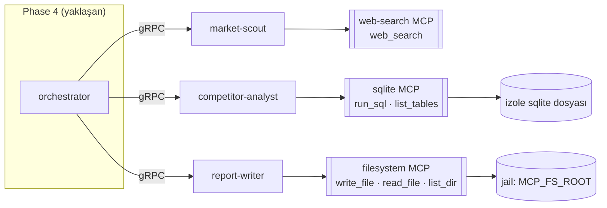

# Phase 3 — Muhakeme Günlüğü

Bu doküman, **Phase 3 (diğer iki uzman: `competitor-analyst` + sqlite MCP ve
`report-writer` + filesystem MCP)** görevindeki inceleme, alternatif
değerlendirme, karar ve doğrulama adımlarını gerekçeleriyle kaydeder. Bölüm
5'te gerçekten karşılaştığım iki sorun kanıtıyla birlikte açıkça yazılmıştır.

---

## 0. Görevin kapsamı ve genel yaklaşım

Hedef, Phase 2'de tek ajan için kurulan çatıyı **üç ajana genişletmek** ve
ajanları birbirinden ayıran araç/ihtiyaç profilini gerçek MCP sunucularıyla
göstermekti:

- `competitor-analyst` → izole **sqlite** SQL çalışma alanı.
- `report-writer` → kısıtlanmış **dosya sistemi** çalışma alanı.

Genel strateji:

1. **Önce soyutlamanın sınavı.** Phase 2'de çıkardığım `agentapp` +
   `agentruntime` çatısı işe yarıyor mu? Yeni iki ajan, çatıyı **hiç
   değiştirmeden** eklenebiliyorsa soyutlama doğrudur. Nitekim öyle oldu:
   `cmd/*/main.go` yalnızca Spec + skill + `BuildTools` veriyor.
2. **Araç sunucularını gerçek MCP protokolüyle yaz.** sqlite ve dosya sistemi
   araçları düz fonksiyon değil, `mcpx.NewInProcessServer` ile süreç içi
   **gerçek MCP sunucuları** olarak sunuldu; böylece araç keşfi→çağrı akışı
   bozulmadan çalışır.
3. **İzolasyonu tasarımın merkezine koy.** Kullanıcı "belirgin izolasyon için
   SQL sqlite olsun" dedi; bunu "LLM'in ürettiği SQL, uygulamanın operasyonel
   PostgreSQL'ine asla dokunamaz" şeklinde yorumladım ve öyle uyguladım.
4. **Güvenlik sınırını kodda zorla.** Dosya sistemi aracı "jail" içinde
   çalışır; `../` ile kaçış normalize edilerek etkisizleştirilir.
5. **Her ajana gerçek araç döngüsü testi.** Ortak runtime test edilmiş olsa da,
   her yeni ajanın araç adları/semantiği kendi testiyle doğrulandı.

Faz çıktısı: 9 commit (`ac0eee2` → `84b6550`) + bu muhakeme günlüğü.

---

## 1. İlk inceleme

Kod yazmadan önce doğruladıklarım:

- **Mevcut `agentapp`/`agentruntime` yeniden kullanılabilir mi?** `agentapp.Options`
  yalnızca `Spec`, kart bilgileri, portlar ve **`BuildTools ToolsetFactory`**
  istiyor. Yeni ajanlar tam olarak bu arayüze oturuyor. Bu, Phase 2'deki
  soyutlama kararının geri dönüşünü gördüğüm yerdi.
- **`mcpx.NewFakeServer` adı.** sqlite ve dosya sistemi sunucuları "sahte"
  değil; gerçek, süreç içi MCP sunucuları. Mevcut isim (`Fake`) yanıltıcıydı.
- **MCP Go SDK'nın in-process transport'u.** `NewInMemoryTransports` +
  `server.Connect` (önce sunucu) + `client.Connect` (sonra istemci) kuralı
  Phase 1'de öğrenilmişti; burada da aynı mekanizma kullanıldı.
- **Dağıtım hedefi.** Dockerfile `distroless/static:nonroot` kullanıyor ve
  `CGO_ENABLED=0`. Bu iki kısıt, sqlite sürücüsü seçimini ve çalışma dizini
  kararını doğrudan belirledi (bkz. §2.3 ve §5.2).
- **Mevcut config alanları.** `MCP_SQLITE_DIR` vardı; dosya sistemi için
  karşılığı yoktu (bkz. §2.5).

---

## 2. Mimari kararlar

### 2.1 `mcpx`: "fake" adının "in-process"e çevrilmesi

**Karar:** `FakeTool` → `InProcessTool`, `NewFakeServer` → `NewInProcessServer`
ve dosya `fake.go` → `inprocess.go`.

**Değerlendirdiğim alternatifler:**

- *(A)* Eski isimleri koruyup yeni tipler eklemek (alias).
- *(B)* Var olanı yeniden adlandırmak.

**(B)**'yi seçtim. Gerekçe: "fake" kelimesi, süreç içi **gerçek** MCP
sunucularını (sqlite, dosya sistemi) anlamsız biçimde küçültüyor ve okuyucuyu
"bunlar test dublörü" sanmaya iter. Alias bırakmak ise iki adı kalıcılaştırır.
Yeniden adlandırma, tüm çağrı yerlerini (websearch + 3 test) tek seferde
güncellemeyi gerektirdi ama kavramsal netliği kazandırdı.

### 2.2 SQL için neden sqlite?

**Karar:** competitor-analyst'ın SQL çalışma alanı, ayrı bir **sqlite**
veritabanıdır.

**Değerlendirdiğim alternatifler:**

- *(A)* Uygulamanın kendi PostgreSQL'ini kullanmak (yeni şema/DB).
- *(B)* Harici bir MCP sqlite sunucusuna bağlanmak.
- *(C)* Süreç içi, kendi sqlite dosyasıyla çalışan bir MCP sunucusu yazmak.

**(A)** elendi: LLM'in ürettiği SQL'in, görev/hafıza verisinin tutulduğu
operasyonel veritabanına erişmesi **kabul edilemez bir yüzey** olurdu; bir
`DROP TABLE` veya yanlış bir `UPDATE` gerçek veriyi bozabilir.
**(B)** elendi: gerçek harici bir sqlite MCP sunucusu hazır değil ve kurulum
bağımlılığı getirir.
**(C)** seçildi: izolasyon kod düzeyinde garanti altına alınır (ayrı dosya),
harici bağımlılık yok ve MCP protokolü gerçekten kullanılır.

### 2.3 sqlite sürücüsü: `modernc.org/sqlite`

**Karar:** Saf Go sqlite sürücüsü.

**Alternatifler:** `mattn/go-sqlite3` (cgo gerektirir) vs `modernc.org/sqlite`
(saf Go).

**Gerekçe:** Dockerfile **`CGO_ENABLED=0`** ile statik derliyor ve
`distroless/static` üzerinde çalışıyor. cgo sürücüsü bu hedefi kırar
(glibc/libsqlite3 bağımlılığı). Saf Go sürücü, statik derlemeye uyar. Bedeli:
büyük bir bağımlılık ağacı; ama dağıtım basitliği bunu dengeliyor.

### 2.4 Dosya sistemi: jail ve yol kaçışı

**Karar:** `workspacefs` tüm yolları `MCP_FS_ROOT` altına hapseder.

**Uyguladığım savunma:** `filepath.Clean("/" + rel)` ile baştaki `..`
bileşenlerini yok edip yolu köke sabitledim; ardından `filepath.Abs` + prefix
kontrolüyle ek güvence ekledim. Örnek: `../../escape.txt` → `clean("/../../escape.txt")`
= `/escape.txt` → kök/escape.txt. Yani kaçış bir hata değil, **etkisizleştirme**
ile engellenir (yazma yine de kök içinde kalır).

**Neden hata fırlatmak yerine normalize ettim?** Model yanlışlıkla `..` içeren
bir yol üretebilir; bunu sert bir hatayla reddetmek yerine güvenli biçimde köke
indirmek, aracı daha kullanışlı kılar ve yine de sınırı aşmaz. Bunu
`TestWorkspaceContainsPathTraversal` ile kanıtladım.

### 2.5 Config: `MCP_FS_ROOT`

**Karar:** `MCPConfig`'e `FSRoot` (`MCP_FS_ROOT`, varsayılan `./data/workspace`)
eklendi.

**Gerekçe:** sqlite için `MCP_SQLITE_DIR` vardı; dosya sistemi çalışma alanının
da yapılandırılabilir bir kökü olmalı. `Blob.FSRoot`'u (artefakt deposu) yeniden
kullanmadım: artefakt blob deposu ile ajan çalışma alanı **farklı sorumluluklar**
ve farklı yaşam döngüleri; bunları tek ayarda birleştirmek ileride ikisinden
birini bağımsız değiştirmeyi zorlaştırırdı.

---

## 3. Araç ve ajan tasarımı



Her ajan için ayarladığım değerler:

| Ajan | Skill ID | Artefakt | Araçlar | Model env |
|---|---|---|---|---|
| market-scout | `market_research` | `market-brief` | `web_search` | `MARKET_SCOUT_MODEL` |
| competitor-analyst | `competitor_analysis` | `competitor-matrix` | `run_sql`, `list_tables` | `COMPETITOR_ANALYST_MODEL` |
| report-writer | `report_writing` | `final-report` | `write_file`, `read_file`, `list_dir` | `REPORT_WRITER_MODEL` |

**System instruction'larda bilinçli vurgular:** competitor-analyst'a "SQL
yalnızca senin yüklediğin veriyi içerir" ve "iddialarını gerçekten sorguladığın
veriye dayandır", report-writer'a "kullanıcı yalnızca verilen bulguları
kullan, uydurma" kuralını koydum. Gerekçe: tool-calling ajanlarında en olası
arıza "veri uydurma"; talimat ve araç izolasyonu bunu birlikte sınırlar.

---

## 4. Test / doğrulama stratejisi

Üç katman:

1. **Araç sunucusu testleri.** `TestSqliteMCPRunsQueries` (create/insert/select
   + `list_tables`), `TestSqliteMCPRejectsEmptySQL`; `TestWorkspaceWriteReadList`,
   `TestWorkspaceContainsPathTraversal`. Bu katman MCP sunucusunun doğru
   çalıştığını ve sınırların tutulduğunu kanıtlar.
2. **Ajan döngüsü entegrasyon testleri (yeni).** `TestCompetitorAnalystToolLoop`
   ve `TestReportWriterToolLoop`, **scripted LLM + gerçek araç seti** ile
   `agentruntime` döngüsünü baştan sona çalıştırır; artefaktı ve disk yan
   etkisini (yazılan rapor dosyası) doğrular. Gerekçe: ortak runtime test
   edilmiş olsa da, her ajanın **araç adı/semantiği** eşleşmesi kendi testinde
   kanıtlanmalı.
3. **Canlı süreç duman testi.** Docker Postgres + iki gerçek ajan süreci;
   her biri kendi AgentCard'ını yayınladı ve MCP araçlarını keşfetti
   (`competitor-analyst` → 2 araç, `report-writer` → 3 araç).

Ayrıca `go vet ./...`, `gofmt -l .`, `go test ./...`
(`TEST_POSTGRES_DSN` ile), `docker compose config -q` ve iki ajan için
`docker build` (arka planda) çalıştırıldı; hepsi başarılı.

---

## 5. Karşılaşılan sorunlar

### 5.1 zsh'te kelime bölünmesi (küçük ama öğretici)

**Belirti:** Yeniden adlandırma için tek satırda topladığım dosya listesini
`for f in $files` ile döndürünce komut şu hatayı verdi:

```
sed: internal/mcpx/fake.go
internal/mcpx/mcpx_test.go
internal/websearch/websearch.go ...: No such file or directory
```

**Kök neden:** Kabuk **zsh** (varsayılan olarak) tırnaksız `$files`
değişkenini kelimelere bölmez; tüm çok satırlı liste tek argüman olarak `sed`'e
gitti. Bu, bash alışkanlığıyla yazılmış bir komutun zsh'te sessizce farklı
davranmasının tipik örneği.

**Düzeltme:** Dosyaları açıkça listeleyip her birine ayrı `sed` uyguladım
(`for f in file1 file2 ...`). **Ders:** zsh'te `$var`'ı tırnaksız döngüye
vermek güvenilir değil; dosya listelerini açıkça yazmak veya `${(f)var}` gibi
zsh'e özgü bölme kullanmak gerekir.

### 5.2 distroless/nonroot konteynerde yazılabilir dizin

**Fark ettiğim risk:** Varsayılan `MCP_SQLITE_DIR=./data/sqlite` ve
`MCP_FS_ROOT=./data/workspace` göreli yollardır. Konteynerde çalışma dizini
(distroless'te kök) nonroot kullanıcı için yazılamaz; bu, Docker önizlemesinde
çalışma anında hataya yol açardı.

**Çözüm:** `docker-compose.yml`'de bu iki servis için yazılabilir yollar
tanımlandı: `MCP_SQLITE_DIR: /tmp/a2a/sqlite` ve
`MCP_FS_ROOT: /tmp/a2a/workspace`. Gerekçe: önizleme ortamı için kalıcılık
gerekmiyor; `/tmp` nonroot tarafından yazılabilir ve özel volume gerektirmez.
Üretimde buraya kalıcı bir volume bağlanmalı (Phase 6 notu).

---

## 6. Commit stratejisi

Yine bağımlılık yönüne göre sıraladım; her commit derlenebilir:

```
84b6550 docs: document phase 3 agents and mark phase 3 complete
b774b3e build: configure agent advertise hosts and mcp dirs
70c364d feat(report-writer): wire report writing agent
c54053e feat(competitor-analyst): wire competitor analysis agent
906f439 feat(workspacefs): add jailed filesystem mcp workspace
feb9df9 feat(sqlitemcp): add isolated sqlite mcp workspace
2ef5259 feat(config): add mcp filesystem root
5847755 chore(deps): add pure-go sqlite driver
ac0eee2 refactor(mcp): rename in-process server api
```

- **Refactor önce:** `mcpx` isim değişikliğini en başa koydum ki sonraki
  feature commit'leri yeni API adını kullansın; karışık bir diff oluşmasın.
- **Bağımlılık ayrı commit:** `go.mod`/`go.sum` tek başına (`5847755`), böylece
  sqlite sürücüsünün eklenmesi geri alınabilir izole bir değişiklik olur.
- **Ajan başına bir commit:** `competitor-analyst` ve `report-writer` ayrı;
  biri geri alınırsa diğeri etkilenmez.

---

## 7. Bilinçli olarak ertelenenler / açık noktalar

- **Orchestrator yok:** Ajanlar hâlâ birbirinden habersiz; gerçek çok-ajan
  akışı Phase 4'ün işi. Bu fazda ajanları bağımsız doğruladım.
- **Gerçek web-search:** `MCP_WEBSEARCH_URL` yoksa market-scout deterministik
  sahte aramaya düşer; gerçek sağlayıcı anahtarı gelince devreye girer.
- **sqlite kalıcılığı (Docker):** Önizlemede `/tmp`; üretimde volume gerekir.
- **Araç yetkilendirme:** Araçlar şu an yalnızca ajan sürecinin güven
  sınırıyla korunuyor; araç-bazlı yetki/limit Phase 6'da düşünülebilir.
- **Paylaşımlı DB havuzu:** Phase 1'den taşınan açık uç; hâlâ Phase 6.

---

## 8. Kısa özet

| Karar | Seçim | Ana gerekçe |
|---|---|---|
| `mcpx` API adı | `InProcessTool`/`NewInProcessServer` | Süreç içi gerçek sunucuları "fake" diye küçültmemek |
| SQL deposu | İzole sqlite | Operasyonel PostgreSQL'e erişimi tümden kes |
| sqlite sürücüsü | `modernc.org/sqlite` (saf Go) | `CGO_ENABLED=0` + distroless uyumu |
| Dosya sistemi | Jail + normalize | Yol kaçışını etkisizleştir |
| Config | `MCP_FS_ROOT` | Çalışma alanını blob deposundan ayır |
| Ajan ekleme | Çatıyı değiştirmeden | Phase 2 soyutlamasının doğrulanması |
| Test | Araç testleri + ajan döngüsü + canlı smoke | Her ajanın araç eşleşmesini kanıtla |
| Docker yolları | `/tmp/a2a/...` | nonroot distroless'te yazılabilir |
