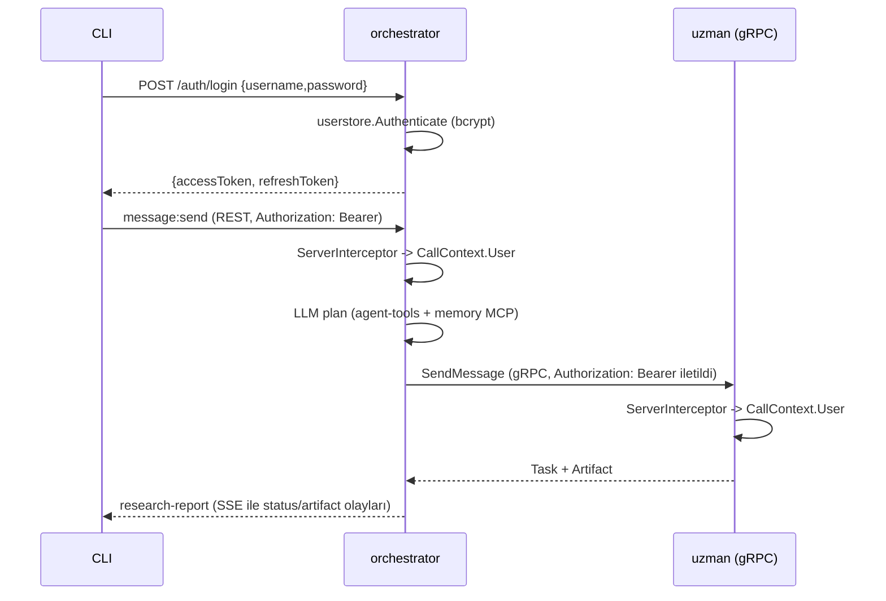

# Phase 4 — Muhakeme Günlüğü

Bu doküman, **Phase 4 (organizatör: REST girişi + JWT uçları + gRPC delegasyon
+ streaming)** görevindeki inceleme, alternatif değerlendirme, karar ve
doğrulama adımlarını gerekçeleriyle kaydeder. Bölüm 5'te yazarken yaptığım
gerçek hatalar ve düzeltmeleri açıkça yazılmıştır.

---

## 0. Görevin kapsamı ve genel yaklaşım

Hedef, sistemi dış dünyaya açan **orchestrator** ajanını kurmaktı: dış isteği
REST ile karşılamak, JWT üretmek/doğrulamak, işi uzmanlara devretmek ve
sonuçları tek raporda sentezlemek.

İzlediğim strateji:

1. **Orchestrator'ı "başka bir ajan" olarak modelle.** `agentapp` +
   `agentruntime` çatısını tekrar kullan; orchestrator'ın araçları uzman
   ajanlar olsun. Böylece planlama/sentez, halihazırda test edilmiş tool-calling
   döngüsüyle yapılır.
2. **Ajanları araç olarak sun (agent-as-tool).** Uzmanlar `tool.Provider`
   arayüzüne sarılırsa LLM onları "araç çağırır gibi" gRPC üzerinden çağırır.
3. **Kimliği uçtan uca taşı.** CLI→orchestrator (REST+JWT) ve
   orchestrator→uzmanlar (gRPC+JWT) aynı token akışıyla korunur.
4. **Gereksiz yeni soyutlama üretme.** `agentapp`'i tümden değiştirmek yerine
   REST + auth uçlarını **eklemeli** genişlettim; mevcut uzmanlar etkilenmedi.
5. **Kanıta dayalı doğrula.** Canlı orchestrator'a karşı gerçek `login` +
   yetkisiz reddi + yetkili REST çağrısı gösterildi.

Faz çıktısı: 13 commit (`4cbf4a0` → `a4a6d81`) + bu muhakeme günlüğü.

---

## 1. İlk inceleme

Kod yazmadan önce doğruladıklarım:

- **REST binding nasıl sunuluyor?** `a2asrv.NewRESTHandler(handler)` bir
  `http.Handler` döndürür ve `"/"` altına mount edilir; AgentCard'da
  `a2a.TransportProtocolHTTPJSON` arayüzü `http://host:port` olarak ilan
  edilir. İstemci, karttaki arayüzden taşımayı seçer.
- **İstemci taşıma seçimi.** `a2aclient.NewFromCard` karttaki
  `SupportedInterfaces` ile `WithRESTTransport`/`WithGRPCTransport`
  seçeneklerini eşler. Yani uzmanların kartı yalnızca gRPC ilan ederse istemci
  gRPC'ye gider.
- **Auth nasıl sızıyor?** `a2aclient` tarafında `CallInterceptor` çağrıya
  `Authorization` ekliyor; sunucu tarafında `CallContext.ServiceParams()` bunu
  okuyor. Phase 1'de bunu kurmuştum; Phase 4'te **uçtan uca** çalıştığını
  gördüm.
- **CallContext'in executor'a ulaşması.** Orchestrator'ın `CallTool`'una geçen
  `ctx`, sunucunun istek bağlamı olduğundan `a2asrv.CallContextFrom(ctx)` ile
  kullanıcı/token erişilebilir. Tokensız durumda yeni servis token'ı üretme
  yolunu bu yüzden ekledim.

---

## 2. Mimari kararlar

### 2.1 Orchestrator = LLM planlı delegasyon (deterministik pipeline değil)

**Karar:** Orchestrator bir LLM döngüsü çalıştırır; uzmanlar modele **araç**
olarak sunulur. LLM hangi uzmanı hangi sırayla çağıracağına kendisi karar verir.

**Değerlendirdiğim alternatifler:**

- *(A)* Sabit pipeline: `market_scout` → `competitor_analyst` →
  `report_writer` (kodda sabit sıra).
- *(B)* LLM'in araç çağrılarıyla planlama.

**(A)** daha öngörülebilir olurdu ama:
- "Orchestrator'ın LLM + tool-calling yeteneği" gereksinimini gösteremezdi;
  pipeline, LLM'siz de çalışırdı.
- Farklı istekler (ör. yalnızca rakip analizi) için gereksiz adımlar çalışırdı.

**(B)** seçildi: planlama gerçek bir LLM kararı olur ve tool-calling döngüsü
zaten Phase 2'de test edilmiştir. Bedeli: determinizm azalır (LLM yanlış sıra
seçebilir); system instruction ve `MaxToolIterations=8` ile sınırladım.

### 2.2 `tool.Composite`: sağlayıcıları birleştirme

**Karar:** Agent-as-tool (A2A) ile MCP araçlarını tek `tool.Provider`'da
birleştiren bir `Composite`.

**Değerlendirdiğim alternatifler:**

- *(A)* Yok say: orchestrator yalnızca agent-tools kullansın (MCP gereksinimi
  karşılanmaz).
- *(B)* `agenttool.Registry` içine MCP araçlarını da göm.
- *(C)* Ayrı, genel bir `Composite`.

**(C)** seçildi. Gerekçe: birleştirme mantığı (yineleme kontrolü, yönlendirme)
zaten `toolbox`'ta vardı; onu tekrar yazmak yerine `tool.Provider` düzeyinde
genelleştirdim. Böylece herhangi iki sağlayıcı birleştirilebilir ve tekrar
yok. **(B)** elendi çünkü `Registry`'yi MCP'ye bağımlı kılmak katman karışımı
olurdu ve `Registry` test edilebilirliği azalırdı.

### 2.3 `agenttool.Registry`: tembel kart çözümleme + token iletimi

**Karar:** Kart, istemci ilk kez çağrıldığında çözülür ve önbelleğe alınır.
Giden çağrıya **gelen isteğin token'ı iletilir**; yoksa orchestrator adına yeni
token üretilir.

**Alternatifler (kart çözümleme zamanı):**

- *(A)* Başlangıçta tüm kartları çöz (fail-fast).
- *(B)* Tembel çözümleme + önbellek.

**(A)** elendi: orchestrator, uzmanlar hazır olmadan da ayağa kalkabilmeli
(dev deneyimi + gevşek bağlılık). **(B)** seçildi; `agenttool` testinde tembel
çözümlemenin gerçek kart+gRPC ile çalıştığını doğruladım.

**Alternatifler (token):**

- *(A)* Kullanıcının token'ını aynen ilet.
- *(B)* Orchestrator yeni servis token'ı üretsin.

**(A)** birincil yol oldu (aynı secret/issuer sayesinde uzmanlar doğrular;
ayrıca "kimlik propagasyonu" güzel bir gösterim). **(B)** yalnızca token yokken
(ör. kimlik doğrulama kapalıyken) yedek olarak eklendi.

### 2.4 Orchestrator'ın MCP kullanımı: memory MCP

**Karar:** Uzun vadeli hafızayı `recall_memory` / `remember_note` araçları
olarak sunan in-process bir MCP sunucusu (`memorymcp`).

**Alternatifler:**

- *(A)* Orchestrator'da MCP kullanma (gereksinimi es geçer).
- *(B)* Anlamsız bir "planlama stub" MCP.
- *(C)* Gerçek işe yarayan hafıza MCP.

**(C)** seçildi: LLM artık önceki oturumlardan not çekebilir/yazabilir, yani
MCP yüzeyi gerçek bir yetenek. **Dikkat ettiğim tuzak:** `memory_semantic`
tablosuna farklı modellerle gömme yazmak. `agentapp`'te kullanılan embedder
seçimini `NewEmbedder` olarak dışa açtım ve orchestrator'ın araç seti de **aynı**
embedder'ı kullanıyor; böylece vektör uzayı tutarlı kalıyor.

### 2.5 `input-required`: netleştirme aracı

**Karar:** `Spec.ClarificationTool` tanımlıysa runtime, modele bir `ask_user`
aracı sunar; LLM bunu çağırınca görev `input-required` durumuna geçer ve akış
durur.

**Neden?** A2A'nın insan-döngüde özelliğini göstermek istedim. Uygulaması
küçük ve mevcut döngüye temiz oturuyor: araç çağrısı yakalanır, bir
`TaskStatusUpdateEvent` (input-required) + soru içeren mesaj yayınlanır,
sentinel hata ile döngü sonlanır. `Execute` bu sentinel'i "başarısızlık" değil
"dur" olarak yorumlar. Devam mesajı geldiğinde görev aynı bağlamda sürer.

### 2.6 JWT uçları ve kullanıcı deposu

**Karar:** `/auth/login` + `/auth/refresh`; kullanıcılar PostgreSQL `users`
tablosunda **bcrypt** hash ile saklanır.

**Alternatifler:**

- *(A)* Parolasız login (yalnızca kullanıcı adı) — anahtarsız demo.
- *(B)* Ortam değişkeninde düz parola.
- *(C)* Postgres + bcrypt.

**(A)/(B)** elendi: "production-level" beklentisiyle bağdaşmaz ve parola
doğrulamasını anlamsız kılar. **(C)** seçildi; projenin veritabanı kararıyla
da tutarlı. Ek güvenlik: yanlış kullanıcı ve yanlış parola **aynı** hatayı
(`ErrInvalidCredentials`) döndürür ve kullanıcı yokken de bcrypt maliyeti
ödenir (zamanlama sızıntısını azaltmak için).

### 2.7 `agentapp` genişletmesi: taşımalar ve auth uçları

**Karar:** `Options`'a `RESTPort` ve `AuthEndpoints` eklemek; kart arayüzlerini
`GRPCPort`/`RESTPort`'tan üretmek.

**Alternatifler:**

- *(A)* Orchestrator için ayrı bir sunucu katmanı yazmak (kod tekrarı).
- *(B)* `agentapp`'i eklemeli genişletmek.

**(B)** seçildi: uzmanların kablolaması (taskstore, memory, auth interceptor,
card) aynı; yalnızca taşıma ve auth uçları farklı. Ayrı katman, aynı kablolamayı
kopyalardı. Kart arayüzlerini tek yerden üretmek, "dış istek REST" kuralını da
kodda görünür kılıyor.

---

## 3. Taşıma ve kimlik akışı



İki sınır da aynı JWT mekanizmasıyla korunur; iki farklı taşıma (REST dışarı,
gRPC içeri) `CallContext` üzerinden aynı kullanıcıya çözülür.

---

## 4. Test / doğrulama stratejisi

1. **Birim testleri:** `tool.Composite` (yönlendirme, yinelenen araç, bilinmeyen
   araç), `memorymcp` (remember/recall), `authhttp` (login/refresh, hatalı
   kimlik, hatalı token), `agentruntime` clarification (input-required, artefakt
   üretilmez).
2. **Gerçek entegrasyon testleri:** `agenttool` testi **HTTP AgentCard +
   gerçek gRPC** ile bir uzmanı keşfedip araç olarak çağırır ve artefakt metnini
   doğrular. `userstore` testi Postgres'e karşı bcrypt doğrulamasını kanıtlar.
3. **Canlı uçtan uca smoke:** gerçek orchestrator süreci + Postgres:
   - `/auth/login` → 200 + token (`login status=200 token=true`),
   - kart 1 arayüz (REST) yayınladı,
   - **yetkisiz** REST çağrısı reddedildi (`missing bearer token`),
   - **yetkili** REST çağrısı `TASK_STATE_COMPLETED artifacts=1` döndü.
4. **Statik/toplayıcı doğrulama:** `go build ./...`, `go vet ./...`,
   `gofmt -l .`, `go test ./...` (`TEST_POSTGRES_DSN` ile),
   `docker compose config -q`, `docker build` (orchestrator, arka planda).

Bu katmanlar, REST binding + JWT propagasyonu + server interceptor'ın REST
transport'undan da çalıştığını **kanıtladı** — Phase 1'de yalnızca birim
düzeyinde gördüğüm şeyin gerçeği.

---

## 5. Yazarken yapılan hatalar ve düzeltmeleri

### 5.1 `authhttp.go` ilk sürümü bozuktu

**Belirti:** İlk yazdığım `authhttp.go`'da hem gereksiz bir `Authenticator`
arayüzü hem de `UserAuthenticator` vardı; ayrıca `context` import edilmeden
`context.Context` kullanılmıştı.

**Kök neden:** İki farklı soyutlamayı tek dosyada taslaklarken kalıntı bıraktım.

**Düzeltme:** Dosyayı baştan, tek net `UserAuthenticator` arayüzü ve doğru
importlarla yeniden yazdım. **Ders:** Üretilen iskelet kod, derlemeden öteye
gitmeden temizlenmeli.

### 5.2 `toolboxFromClient` adında olmayan bir yardımcıya referans

**Belirti:** `cmd/orchestrator/main.go`'da memory MCP istemcisini sarmak için
`toolboxFromClient` çağırdım; böyle bir fonksiyon yoktu.

**Düzeltme:** Mevcut `toolbox.New(ctx, client)` kullandım. Zaten Phase 2'de bir
MCP istemcisini `tool.Provider`'a saran fonksiyon buydu; gereksiz bir yardımcı
uydurmak yerine var olanı kullanmak doğruydu.

### 5.3 Bayrak adı yanılgısı: orchestrator için `-grpc-port`

**Fark ettiğim sorun:** Orchestrator REST kullanıyor ama `ParseServer` yalnızca
`-grpc-port` tanımlıyordu; orchestrator onu REST portu olarak kullanacaktı. Bu,
CLI'da yanıltıcı bir bayrak adı olurdu.

**Düzeltme:** `ServerDefaults` ve `entrypoint.Options`'a `RESTPort` ekledim;
`ParseServer` artık `-grpc-port`, `-rest-port`, `-card-port` tanımlıyor. Uzmanlar
`-grpc-port`, orchestrator `-rest-port` kullanıyor. Compose komutu da
`-rest-port=9100` olarak güncellendi.

---

## 6. Commit stratejisi

13 commit, bağımlılık yönüne göre; her biri derlenebilir:

```
a4a6d81 docs: document orchestrator and mark phase 4 complete
33cdabe build: wire orchestrator rest and auth in compose
2e0250d feat(orchestrator): add planning and delegation agent
f0f0c3f refactor(agentapp): support rest transport and auth endpoints
dff606b feat(authhttp): add jwt login and refresh endpoints
a4a05e0 feat(userstore): add bcrypt postgres user store
e52b782 feat(agentruntime): support input-required clarification
33153dd feat(agenttool): expose remote agents as tools
888169b feat(memorymcp): expose memory as mcp tools
2d0d6d3 feat(auth): expose bearer token from call context
3ccd7a7 feat(tool): add composite provider
b07846f chore(deps): add bcrypt for user credentials
4cbf4a0 feat(config): add agent endpoints and auth seed config
```

- **Config ilk:** sonraki commit'lerin derlenmesi için.
- **Bağımlılık ayrı:** `bcrypt` eklenmesi izole ve geri alınabilir.
- **Genel → özel:** `tool.Composite`, `auth` yardımcısı, `memorymcp`,
  `agenttool`, sonra `orchestrator` (hepsini tüketen komut).
- **`refactor(agentapp)` ayrı:** mevcut üç uzmanı etkileyen taşıma genişlemesi,
  feature'dan ayrı tutuldu ki regresyon izole olsun.

---

## 7. Bilinçli olarak ertelenenler / açık noktalar

- **CLI yok:** Streaming'i **tüketen** istemci Phase 5'in işi; bu fazda
  orchestration yalnızca proxy istemci ve süreç düzeyinde doğrulandı.
- **Token iptali (revocation):** Refresh var; iptal listesi yok.
- **TLS/mTLS:** Ajanlar arası gRPC `insecure` (dev). Üretimde TLS gerekir.
- **Gerçek embeddings:** Hat hazır; mock/gerçek seçimi `NewEmbedder`'da.
- **Paylaşımlı DB havuzu:** Orchestrator'ın memory MCP'si ikinci bir havuz
  açıyor (not edilmiş teknik borç, Phase 6).
- **Push notification:** Hâlâ ertelenmiş durumda (karar gereği).
- **Deterministik sıra yok:** LLM planı doğası gereği esnek; gözlemlenebilirlik
  için `working` mesajlarında araç adı loglanıyor.

---

## 8. Kısa özet

| Karar | Seçim | Ana gerekçe |
|---|---|---|
| Orchestrator modeli | LLM planı + agent-as-tool | LLM/tool-calling yeteneğini gerçekten göster |
| Araç birleştirme | `tool.Composite` | Yinelenen araç yok, katman temiz |
| Uzak ajan istemcisi | Tembel kart çözümleme + token iletimi | Gevşek bağlılık + kimlik propagasyonu |
| Orchestrator MCP | memory MCP (paylaşımlı embedder) | Gerçek yetenek + vektör tutarlılığı |
| İnsan-döngüde | `ask_user` → input-required | A2A'nın etkileşim özelliğini göster |
| Kullanıcı doğrulama | Postgres + bcrypt | Production-grade, DB kararıyla tutarlı |
| Sunucu | `agentapp` REST + auth genişletmesi | Kod tekrarından kaçın |
| Doğrulama | Birim + kart/gRPC entegrasyonu + canlı smoke | REST/JWT gerçeğini kanıtla |
