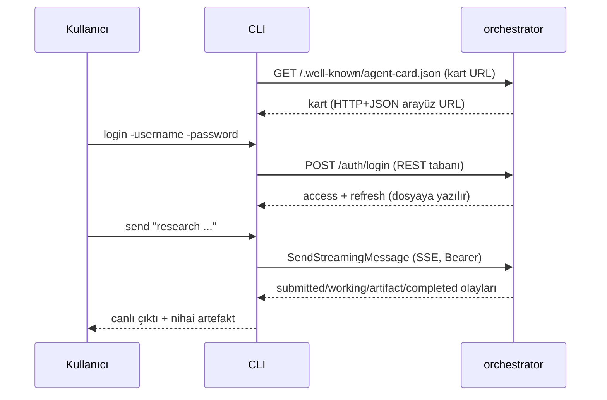

# Phase 5 — Muhakeme Günlüğü

Bu doküman, **Phase 5 (CLI: JWT login/refresh, streaming, görev ve artefakt
işlemleri)** görevindeki inceleme, alternatif değerlendirme, karar ve doğrulama
adımlarını gerekçeleriyle kaydeder. Bölüm 5'te karşılaştığım gerçek hatalar ve
düzeltmeleri açıkça yazılmıştır.

---

## 0. Görevin kapsamı ve genel yaklaşım

Hedef, backend'i tüketen bir **CLI** yazmaktı (frontend yok): JWT login/refresh,
REST üzerinden streaming mesaj gönderme, görev listeleme/inceleme, artefakt
görüntüleme ve iptal.

Strateji:

1. **Var olan SDK istemcisini kullan.** `a2aclient` + REST transport zaten
   karttan taşıma seçiyor; kendi HTTP/SSE katmanımı yazmadım.
2. **Kimliği dosyada sakla, otomatik yenile.** Kullanıcı her komutta token
   yapıştırmasın; token sona ermek üzereyse sessizce yenile.
3. **Bağımlılık ekleme.** Alt komutlar için CLI framework'ü yerine stdlib
   `flag` kullandım.
4. **Akışı görünür kıl.** `SendStreamingMessage` olaylarını canlı yaz, nihai
   artefaktı toplayıp en sonda bas.
5. **Kanıtla.** Tam yığın (Postgres + orchestrator) üzerinde gerçek CLI ile
   login → send (SSE) → tasks → task → artifact → cancel gösterildi.

Faz çıktısı: 7 commit (`5659b4e` → `febe1e1`) + bu muhakeme günlüğü.

---

## 1. İlk inceleme

Kod yazmadan önce netleştirdiklerim:

- **Kart → REST tabanı:** Auth uçları (`/auth/login`, `/auth/refresh`) **REST
  sunucusunda** (ör. `:9100`) yaşar; kart ise ayrı bir HTTP portunda (`:9200`).
  CLI önce **public kartı** çözer, sonra karttaki `HTTP+JSON` arayüz URL'sini
  REST tabanı olarak kullanır. Böylece kullanıcı yalnızca **tek** URL bilir.
- **Streaming API:** `Client.SendStreamingMessage` bir `iter.Seq2[a2a.Event,
  error]` döner; hata dönerse döngü kırılır. Olay tipleri: `*a2a.Task`,
  `*a2a.TaskStatusUpdateEvent`, `*a2a.TaskArtifactUpdateEvent`, `*a2a.Message`.
- **İstek tipleri:** `GetTaskRequest{ID}`, `CancelTaskRequest{ID}`,
  `ListTasksRequest{ContextID, PageSize}`.
- **İstemci kimliği:** `a2aclient.WithCallInterceptors(auth.NewClientInterceptor(...))`
  ile `Authorization` eklenir; bu, Phase 4'te sunucu tarafında doğrulandı.

---

## 2. Mimari kararlar

### 2.1 Alt komutlar: stdlib `flag` vs CLI framework

**Karar:** Alt komutları `flag.NewFlagSet` ile elle yazmak.

**Alternatifler:**

- *(A)* `spf13/cobra` gibi bir framework.
- *(B)* stdlib `flag` + manuel dispatch.

**(B)** seçildi. Gerekçe: yalnızca ~8 basit komut var; bir framework eklemek,
kullanıcıya yeni bir bağımlılık ve öğrenilecek yüzey getirir. Proje boyunca
bağımlılık disiplinini korudum; CLI bunu bozmamalı. Bedeli: yardım metni ve
komut ayrıştırma biraz el emeği (kabul edilebilir).

### 2.2 Tek URL ile keşif: kart → REST tabanı

**Karar:** Kullanıcı yalnızca orchestrator **kart URL'sini** verir; CLI, karttan
`HTTP+JSON` arayüzünü bulup hem A2A çağrılarında hem auth uçlarında onu kullanır.

**Alternatifler:**

- *(A)* Kullanıcı iki URL versin (kart + REST).
- *(B)* Auth uçlarını kart sunucusuna da mount et.
- *(C)* Karttan türet.

**(C)** seçildi: en az yapılandırma ve "kart = tek doğruluk kaynağı" ilkesi.
**(B)** elendi çünkü kart sunucusu public/CORS-açık; auth uçlarını oraya koymak
katmanları karıştırırdı.

### 2.3 Token deposu ve otomatik yenileme

**Karar:** Token'ları `~/.a2a-research-crew/tokens.json` dosyasında (0600)
sakla; access token sona ermek üzereyse (`refreshMargin = 30s`) bir sonraki
komutta `POST /auth/refresh` ile yenile.

**Alternatifler:**

- *(A)* Her komutta `-token` bayrağı (kullanıcı token yapıştırır).
- *(B)* Token'ları ortam değişkeninde tut.
- *(C)* Dosyada sakla + otomatik yenile.

**(A)/(B)** kullanıcı deneyimini bozar ve token'ı kabuk geçmişine sızdırır.
**(C)** seçildi; `0600` izni ve `0700` dizin ile sızıntı yüzeyi azaltıldı.
Yenilemeyi interceptor içinde değil **çağrı öncesi** yaptım: 401 dönen bir
isteği otomatik tekrar denemek, taşıma katmanının içine gizli bir yeniden
deneme mantığı sokardı; bunun yerine "kullanmadan önce tazele" yaklaşımı daha
öngörülebilir.

### 2.4 Streaming ve artefakt toplama

**Karar:** Olayları geldikçe yaz; `TaskArtifactUpdateEvent` metnini bir
`strings.Builder`'da biriktir; akış bitince artefaktı ayrıca bas.

**Gerekçe:** Kullanıcı ilerlemeyi (working, araç çağrıları) canlı görür;
nihai çıktı da akışın sonunda bütün olarak elde edilir. Olaylar bir durum
makinesi yerine basit bir `switch` ile işlendi; CLI için yeterli.

### 2.5 Hata mesajlarını olduğu gibi ilet

**Kanıt:** Tamamlanmış bir görevi iptal denemesi şu mesajı verdi:

```
error: failed to cancel: cancelation failed: canceler setup failed: task in non-cancelable state TASK_STATE_COMPLETED: task cannot be canceled
```

Bunu sadeleştirmeden ilettim: A2A'nın durum makinesi ve hata nedeni görünür
kalır; CLI'ın protokolü "yorumlaması" yerine kullanıcıya taşıması doğru.

---

## 3. CLI akışı



---

## 4. Test / doğrulama stratejisi

1. **Birim:** `TokenStore` (kaydet/yükle/temizle, `ExpiringSoon`), `loginRequest`
   ve `refreshRequest` (httptest ile 200/401), `restBaseURL` (eksik HTTP+JSON
   arayüzü hatası), `renderEvent` (status satırları + artefakt toplama).
2. **Canlı uçtan uca smoke:** Postgres + gerçek orchestrator süreci + derlenmiş
   CLI ikilisi:
   - `login` → `logged in as admin`,
   - `send` → `SUBMITTED → WORKING → artifact → COMPLETED` (SSE),
   - `tasks` → iki görev listelendi,
   - `task`/`artifact` → artefakt metni,
   - `cancel` (tamamlanmış) → anlamlı hata,
   - `card` → REST arayüzü + skill.
3. **Statik/build:** `go build/vet/fmt`, `go test ./...`,
   `docker build --build-arg BINARY=cli` (başarılı).

---

## 5. Karşılaşılan hatalar

### 5.1 `render.go`'da yanlış yardımcı fonksiyon

**Belirti:**

```
internal/cli/render.go:24:21: cannot use e.Artifact.Parts (variable of slice type
a2a.ContentParts) as *a2a.Message value in argument to partsText
```

**Kök neden:** İki benzer yardımcı yazdım: `partsText(*a2a.Message)` ve
`messagePartsText(a2a.ContentParts)`. Artefakt güncellemesinde mesaj bekleyen
olanı çağırdım.

**Düzeltme:** Artefakt için `messagePartsText` kullandım. **Ders:** Aynı işi
yapan iki fonksiyon zamanla karışır; ideal olarak tek imza seçilmeliydi. Burada
ikisini de bıraktım çünkü biri `*Message`, diğeri `ContentParts` üzerinde
çalışıyor ve ikisi de kullanılıyor.

### 5.2 zsh'te değişkenin kelimelere bölünmemesi (test komutu)

**Belirti:** Smoke komutlarını bir kez `CLI="go run ./cmd/cli ..."` gibi bir
değişkende tutup `$CLI login ...` çağırınca:

```
zsh:2: no such file or directory: go run ./cmd/cli -server=...
```

**Kök neden:** zsh, tırnaksız değişkenleri kelimelere bölmez; tüm komut tek
"program adı" olarak arandı. (Phase 3'teki `sed` olayının aynısı.)

**Düzeltme:** CLI ikilisini `go build -o /tmp/a2a-cli-bin ./cmd/cli` ile derleyip
doğrudan çağırdım. **Ders:** Uzun komutları değişkende tutarken zsh'te
`${=VAR}` kullan ya da değişkeni hiç kullanma.

---

## 6. Commit stratejisi

7 commit, mantıksal katmanlara göre:

```
febe1e1 docs: document cli and mark phase 5 complete
48f165a build: add cli client env defaults
dab916c feat(cli): wire cli entrypoint
586d8d8 feat(cli): add command dispatch and commands
545eafe feat(cli): add streaming event rendering
c14a252 feat(cli): add rest client and auth requests
5659b4e feat(cli): add token store with auto-refresh margin
```

- **Alttan üste:** token deposu → istemci/auth → render → komutlar → giriş
  noktası. Her commit derlenebilir.
- **Env ve docs ayrı:** yapılandırma ve doküman, kodcommit'lerinden ayrıldı.

---

## 7. Bilinçli olarak ertelenenler / açık noktalar

- **Etkileşimli parola istemi:** Şimdilik `-password`/`A2A_PASSWORD`; TTY'de
  gizli okuma Phase 6'da eklenebilir.
- **`input-required` resume UX'ı:** Runtime ve protokol destekliyor; CLI'da
  "soru geldi, yanıtı gönder" akışı henüz özel komut olarak yok (`send` ile
  aynı göreve devam edilebilir).
- **İkili artefaktlar:** Şu an yalnızca metin parçaları basılıyor; dosya
  artefaktlarının indirilmesi eklenebilir.
- **Push aboneliği (`SubscribeToTask`):** Kullanılmıyor (push ertelenmişti).
- **Renkli çıktı / shell completion:** İşlevsel değil, ertelendi.
- **Token dosyası kilidi:** Eşzamanlı CLI çağrılarında yarış olabilir; düşük
  risk, not edildi.

---

## 8. Kısa özet

| Karar | Seçim | Ana gerekçe |
|---|---|---|
| Alt komutlar | stdlib `flag` | Bağımlılık disiplinini koru |
| Sunucu URL | Tek kart URL → REST türet | En az yapılandırma |
| Token | Dosya + otomatik yenile | UX + kabuk geçmişine sızmama |
| Streaming | Olayları canlı yaz + artefakt topla | İlerleme görünür, çıktı bütün |
| Hatalar | Olduğu gibi ilet | Protokol durumu görünür kalsın |
| Doğrulama | Birim + tam yığın canlı smoke | Gerçek kullanıcı yolunu kanıtla |
