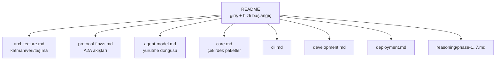

# Phase 7 — Muhakeme Günlüğü

Bu doküman, **Phase 7 (dokümantasyon ve finalizasyon)** görevindeki inceleme,
karar ve doğrulama adımlarını gerekçeleriyle kaydeder. Phase 6 (edge-case
sağlamlaştırma) kullanıcı kararıyla iptal edildiği için bu faz doğrudan
yürütülmüştür. Bölüm 5'te karşılaştığım gerçek sorunlar açıkça yazılmıştır.

---

## 0. Görevin kapsamı ve genel yaklaşım

Hedef, projeyi "okunabilir ve çalıştırılabilir" hale getirmekti: güncel bir
README, mimari/protokol/geliştirme/dağıtım dokümanları, doğru diyagramlar ve
tutarlı bir doküman indeksi.

Strateji:

1. **Önce mevcut dokümanları denetle, sonra yaz.** README uzun süredir
   güncellenmemişti ("Durum: Phase 0") ve bir doküman dosyası beklenmedik bir
   soruna yol açıyordu (bkz. §5.1).
2. **İş bölümü yap.** README = giriş + hızlı başlangıç; `docs/` = derin
   anlatım (mimari, akışlar, geliştirme, dağıtım).
3. **Diyagramları kodla tutarlı tut.** Mermaid diyagramlarını gerçek
   paket/port/akış isimleriyle yaz.
4. **Kod değişikliğini minimumda tut.** Bu faz ağırlıklı olarak dökümantasyon;
   tek "kod" değişikliği `.env.example`'a eksik bir değişken eklemekti.
5. **Doğrula.** Tüm README bağlantılarını ve Go toolchain'ini çalıştır.

Faz çıktısı: 7 commit (`29c7f67` → `c627931`) + bu muhakeme günlüğü.

---

## 1. İlk inceleme

- **README durumu:** Başlıkta hâlâ "Phase 0" yazıyordu ve yol haritası
  güncel değildi; proje Phase 5'i bitirmişti. Ayrıca kurulum adımları fazla
  yüzeyseldi.
- **Doküman envanteri:** `docs/` altında `architecture.md`, `core.md`,
  `cli.md`, `agents.md` ve `reasoning/` vardı. Eksikler: protokol akışları,
  geliştirme ve dağıtım kılavuzları.
- **Beklenmedik sorun:** `docs/agents.md`, opencode tarafından **talimat
  dosyası** olarak yüklendi (oturum bağlamına "Instructions from:
  docs/AGENTS.md" olarak girdi). Nedenini §5.1'de açıkladım.
- **Ortam değişkeni denetimi:** `.env.example` `ORCHESTRATOR_MODEL`
  değişkenini içermiyordu; orchestrator kodu bu değişkeni okuyordu.

---

## 2. Kararlar

### 2.1 Doküman yapısı: README + `docs/`

**Karar:** README kısa ve yönlendirici; derin içerik ayrı dosyalarda.

**Alternatifler:**

- *(A)* Her şeyi README'de toplamak (tek, çok uzun dosya).
- *(B)* README + konu başına `docs/` dosyaları.

**(B)** seçildi. Gerekçe: README, "5 dakikada çalıştır" hedefini korumalı;
mimari/akış/geliştirme/dağıtım ayrıntıları arama ve bağlantılandırma açısından
ayrı dosyalarda daha kullanışlı. Ayrıca `docs/` altında konu başına net bir
sahiplenme oluşuyor.

**Oluşturulan/güncellenen dosyalar:**

| Dosya | Amaç |
|---|---|
| `README.md` | Giriş, özellikler, hızlı başlangıç, proje yapısı, yol haritası |
| `docs/architecture.md` | Katmanlar, veri depoları, taşımalar, kimlik |
| `docs/protocol-flows.md` | A2A kavram eşlemesi, görev durumu, uçtan uca akış |
| `docs/agent-model.md` | Ajan yürütme modeli (eski `agents.md`) |
| `docs/core.md` | Çekirdek paketler (Phase 1'den) |
| `docs/cli.md` | CLI kullanımı (Phase 5'ten) |
| `docs/development.md` | Geliştirme, test, yeni ajan ekleme |
| `docs/deployment.md` | Docker/Compose ve üretim notları |
| `docs/reasoning/` | Faz bazlı muhakeme günlükleri |

### 2.2 `docs/agents.md` → `docs/agent-model.md` yeniden adlandırma

**Karar:** Dosyayı yeniden adlandırmak.

**Gerekçe ve alternatifler** §5.1'de ayrıntılı; kısaca: macOS'un
varsayılan büyük/küçük harf duyarsız dosya sisteminde `docs/agents.md`,
opencode'un talimat dosyası deseniyle (`AGENTS.md`) çakışıyordu. Alternatifler
(farklı dizin, adı koruyup yok sayma, `.agents/` kullanma) elendi; en temiz
çözüm adı çakışmayan bir hale getirmekti.

### 2.3 Mermaid diyagramları

**Karar:** Akış/ilişki anlatan her yerde Mermaid; tip, içeriğe göre seçildi.

- `flowchart` → bileşen ve paket katmanları.
- `sequenceDiagram` → uçtan uca ve kimlik akışları.
- `stateDiagram-v2` → A2A görev yaşam döngüsü.

Gerekçe: diyagramlar metin biçiminde kalır (diff'lenebilir, sürüm kontrolüne
uygun) ve GitHub/çoğu görüntüleyici tarafından render edilir.

### 2.4 Env/port tutarlılığı

**Karar:** `.env.example`'a eksik `ORCHESTRATOR_MODEL`'i eklemek ve dokümanlarda
portları kodla birebir eşleştirmek (REST 9100, uzman gRPC 9101–9103, card
9200–9203).

**Gerekçe:** Dokümanın kodla çelişmesi, öğrenme projesinde en pahalı hatadır;
portlar ve değişkenler tek kaynaktan doğrulandı.

### 2.5 Phase 6'nın iptalini dokümante etmek

**Karar:** README yol haritasında Phase 6'yı `[~]` ile "iptal edildi" olarak
işaretlemek.

**Gerekçe:** Yol haritası, tarihsel kararın kaydıdır. Sessizce silmek yerine
"neden atlandı" notunu görünür kılmak, projeyi okuyanın kapsam kararını
anlamasını sağlar.

---

## 3. Doküman haritası



---

## 4. Doğrulama

- **Bağlantılar:** README'deki tüm göreli `./docs/...` bağlantıları bir betikle
  dosya sistemine karşı denetlendi; hepsi `OK`.
- **Go toolchain:** `go build ./...`, `go vet ./...`, `gofmt -l .` temiz (bu
  fazda kod davranışı değişmedi).
- **Geçmiş korunumu:** yeniden adlandırma `git mv` ile yapıldı; `git log --follow`
  geçmişi sürdürür.
- **Env denetimi:** `.env.example` ile `internal/config` anahtarları gözden
  geçirildi; eksik `ORCHESTRATOR_MODEL` eklendi.

---

## 5. Karşılaşılan sorunlar

### 5.1 `docs/agents.md`'nin `AGENTS.md` olarak yüklenmesi

**Belirti:** Oturum bağlamına "Instructions from:
`.../docs/AGENTS.md`" olarak `docs/agents.md` içeriği girdi. Dosyayı
`agents.md` (küçük harf) olarak oluşturmuştum.

**Kök neden:** macOS'un varsayılan dosya sistemi (APFS) **büyük/küçük harf
duyarsızdır**. opencode'un talimat tarayıcısı `AGENTS.md` desenini arar; bu,
`docs/agents.md` ile **aynı dosyaya** çözülür. Sonuç: normal bir doküman, ajan
talimatı gibi davranışı etkileyebilecek biçimde yüklendi.

**Etki:** İçerik zararsızdı ama yanlış katmana sızıyordu; gelecekte bir doküman
güncellemesi istenmeyen biçimde "talimat" olabilirdi.

**Düzeltme:** `git mv docs/agents.md docs/agent-model.md`. Artık talimat
deseniyle çakışmıyor.

**Değerlendirdiğim alternatifler:** (i) dosyayı `docs/` dışına taşımak —
gereksiz; (ii) `AGENTS.md` desenini yok saymak — kontrolümde değil;
(iii) adı değiştirmek — seçildi. **Ders:** Büyük/küçük harf duyarsız
sistemlerde, özel anlam taşıyan dosya adlarından (`AGENTS.md`, `README.md`,
`Makefile`...) kaçınılmalı.

### 5.2 README'nin bayat "Phase 0" durumu

**Belirti:** README başlığında "Durum: Phase 0 (iskelet...)" yazıyordu ama
proje Phase 5'i bitirmişti.

**Kök neden:** Doküman, her fazda güncellenmek yerine faz sonlarında yalnızca
yol haritası işaretlenmiş; üstteki durum cümlesi unutulmuş.

**Düzeltme:** README baştan yazıldı; durum ve içerik kodla hizalandı.
**Ders:** "Tek doğruluk kaynağı" ilkesi dokümanlara da uygulanmalı; durum
bilgisi tek yerde tutulmalı.

---

## 6. Commit stratejisi

```
c627931 build: add orchestrator model env var
514a3e1 docs: rewrite readme for completed project
3af339a docs: add deployment guide
0ae82c3 docs: add development guide
547ff63 docs: add protocol flows with state diagrams
cef03de docs: expand architecture with layers and data stores
29c7f67 docs: rename agents doc to avoid AGENTS.md collision
```

- **Yeniden adlandırma önce:** tek başına ve izole; içerik değişmediği için
  incelemesi kolay.
- **Her doküman ayrı commit:** geri almak veya tek tek gözden geçirmek kolay.
- **Env değişikliği ayrı:** dokümandan bağımsız, yapılandırma değişikliği.

---

## 7. Açık noktalar / notlar

- **Phase 6 bilinçli atlandı:** paylaşımlı DB havuzu, migration boyut kontrolü,
  token iptali, TLS ve ek persistence testleri üretim sertleştirmesi olarak
  açık kalıyor. README ve ilgili faz günlüklerinde not edildi.
- **Gerçek LLM/embedding:** hat hazır; anahtar verildiğinde `LLM_PROVIDER` ve
  `*_MODEL` ile devreye girer.
- **Doküman bakımı:** kod değişince ilgili `docs/` dosyasının güncellenmesi
  beklenir; bu, projenin süregelen disiplinidir.

---

## 8. Kısa özet

| Karar | Seçim | Ana gerekçe |
|---|---|---|
| Doküman yapısı | README + konu bazlı `docs/` | Hızlı başlangıç + derin anlatım ayrımı |
| `agents.md` adı | `agent-model.md` | `AGENTS.md` çakışmasını gider |
| Diyagramlar | Mermaid (flowchart/sequence/state) | Metin, diff'lenebilir, render edilir |
| Env tutarlılığı | `ORCHESTRATOR_MODEL` eklendi | Doküman-kod çelişkisini önle |
| Phase 6 | `[~]` iptal olarak işaretlendi | Kararların tarihsel kaydı |
| Doğrulama | Bağlantı denetimi + Go toolchain | Dokümanın gerçekliğini kanıtla |
